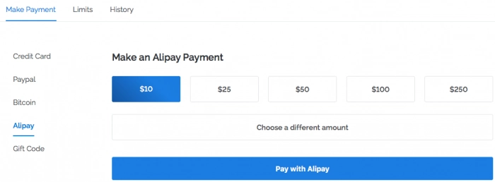
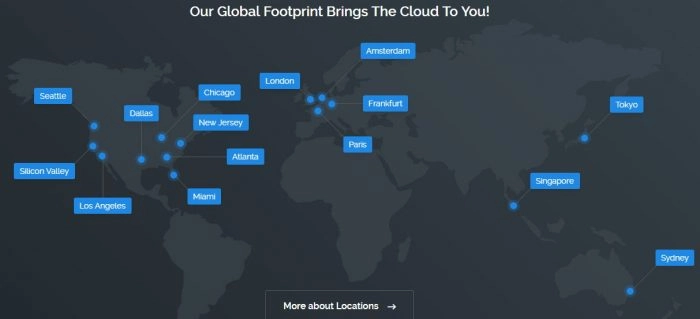

# Vultr开通支付宝付款，新用户最高可获20美元体验金

---

对于需要海外VPS但又担心双币信用卡绑定麻烦的用户来说，支付宝付款无疑是最便捷的选择。Vultr正式上线支付宝支付功能后，充值门槛彻底消失——实时汇率转换，人民币直接支付美元账户，整个过程不到一分钟。更重要的是，Vultr的性价比在同类服务商中始终处于领先位置：KVM架构、SSD固态硬盘、全球多机房覆盖，最低套餐仅需2.5美元/月，这个价格配置组合很难找到对手。

---

## 支付宝付款流程简单直接

登录Vultr后台后，在充值页面选择"Alipay"选项，系统会通过Stripe网关跳转到支付宝付款界面。这里有个细节值得注意：汇率转换是实时进行的，显示的人民币金额就是你实际支付的金额，不会有额外手续费或汇率差。

整个支付流程和国内网购完全一致，输入金额、扫码或密码确认，几秒钟后账户余额就会更新。对于习惯使用支付宝的用户来说，这比绑定信用卡要省心得多。

## 全球机房覆盖，按需选择

Vultr目前在全球部署了十几个数据中心，从亚洲到欧美再到澳洲都有节点。对于大陆用户来说，日本东京机房和美国西海岸机房（洛杉矶、西雅图、硅谷）的延迟表现最好。如果你的业务面向欧洲或者需要欧洲IP，德国法兰克福、荷兰阿姆斯特丹、法国巴黎这些机房也都是不错的选择。

每个机房都提供测试IP和下载测速文件，建议在购买前先测试一下：

- **日本东京**: 108.61.201.151 ([下载测试](http://hnd-jp-ping.vultr.com/vultr.com.1000MB.bin))
- **洛杉矶**: 108.61.219.200 ([下载测试](http://lax-ca-us-ping.vultr.com/vultr.com.1000MB.bin))
- **西雅图**: 108.61.194.105 ([下载测试](http://wa-us-ping.vultr.com/vultr.com.1000MB.bin))
- **硅谷**: 104.156.230.107 ([下载测试](http://sjo-ca-us-ping.vultr.com/vultr.com.1000MB.bin))
- **德国法兰克福**: 108.61.210.117 ([下载测试](http://fra-de-ping.vultr.com/vultr.com.1000MB.bin))
- **法国巴黎**: 108.61.209.127 ([下载测试](http://par-fr-ping.vultr.com/vultr.com.1000MB.bin))
- **荷兰阿姆斯特丹**: 108.61.198.102 ([下载测试](http://ams-nl-ping.vultr.com/vultr.com.1000MB.bin))
- **英国伦敦**: 108.61.196.101 ([下载测试](http://lon-gb-ping.vultr.com/vultr.com.1000MB.bin))
- **新泽西**: 108.61.149.182 ([下载测试](http://nj-us-ping.vultr.com/vultr.com.1000MB.bin))
- **芝加哥**: 107.191.51.12 ([下载测试](http://il-us-ping.vultr.com/vultr.com.1000MB.bin))
- **亚特兰大**: 108.61.193.166 ([下载测试](http://ga-us-ping.vultr.com/vultr.com.1000MB.bin))
- **迈阿密**: 104.156.244.232 ([下载测试](http://fl-us-ping.vultr.com/vultr.com.1000MB.bin))
- **达拉斯**: 108.61.224.175 ([下载测试](http://tx-us-ping.vultr.com/vultr.com.1000MB.bin))
- **澳大利亚悉尼**: 108.61.212.117 ([下载测试](http://syd-au-ping.vultr.com/vultr.com.1000MB.bin))

用ping命令测延迟，下载测速文件看带宽质量，这两步做完基本就能判断哪个机房更适合你的需求。

## 为什么很多Linode老用户选择迁移

从Linode迁移到Vultr的用户不在少数，原因很简单：价格更低、配置更灵活。👉 [Vultr的按小时计费模式让成本控制变得极其精准](https://www.vultr.com/?ref=9738262-9J)，用多少付多少，删除实例后立即停止计费。这对于测试环境或者临时项目来说非常友好。

性能方面，Vultr全系采用KVM虚拟化和SSD存储，这个配置在同价位产品中几乎找不到对手。最低2.5美元/月的套餐已经包含了512MB内存、10GB SSD和500GB流量，用来跑个人博客或小型应用完全够用。

实际使用三年多下来，稳定性确实没让人失望。服务器宕机的情况极少遇到，偶尔有网络波动也会在几分钟内恢复。这种稳定性对于长期运行的服务来说太重要了。

---

## 总结

支付宝付款的开通彻底解决了国内用户购买海外VPS的支付障碍，配合Vultr本身的高性价比和全球机房覆盖，现在上手的门槛已经低到可以忽略不计。如果你正在寻找一个稳定、快速且价格合理的海外VPS方案，👉 [Vultr的多机房选择和灵活计费模式](https://www.vultr.com/?ref=9738262-9J)值得认真考虑——毕竟新用户还能获得最高20美元的体验金，足够测试几个月了。
